# ROS1 and ROS2 Changes
### High Level Architecture Changes
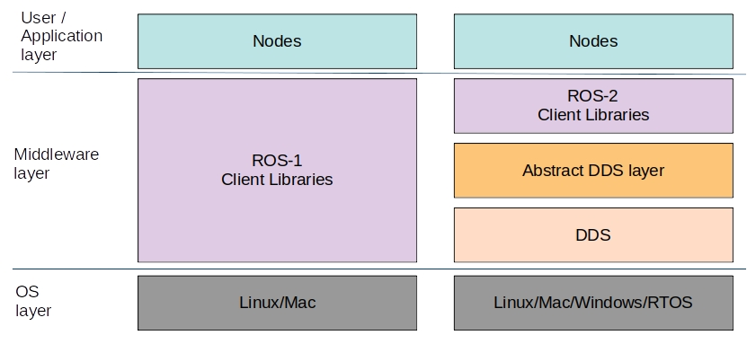

### ROS2 Architecture
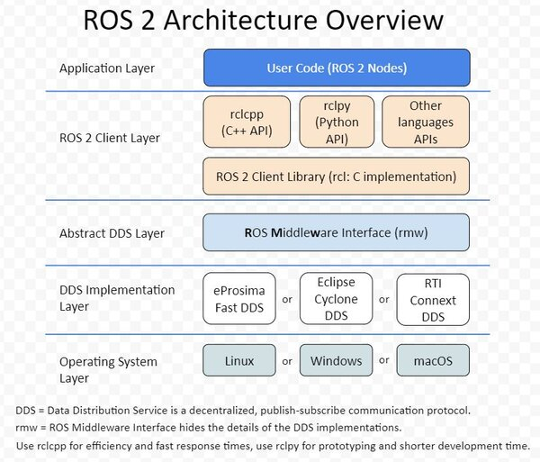

### ROS2 Component flow
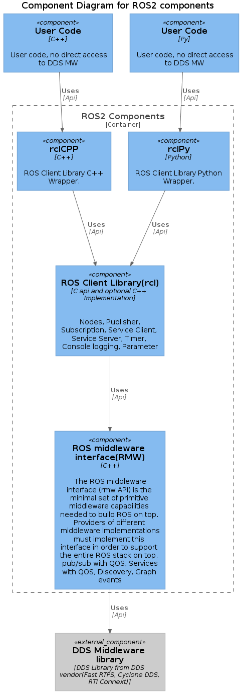

### ROS2 MW Sequence
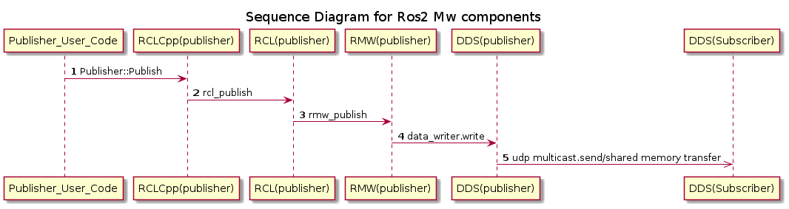

### ROS2 Publisher Sequence
```c++
#include <chrono>
#include <functional>
#include <memory>
#include <string>

#include "rclcpp/rclcpp.hpp"
#include "std_msgs/msg/string.hpp"

using namespace std::chrono_literals;

/* This example creates a subclass of Node and uses std::bind() to register a
* member function as a callback from the timer. */

class MinimalPublisher : public rclcpp::Node
{
  public:
    MinimalPublisher()
    : Node("minimal_publisher"), count_(0)
    {
      publisher_ = this->create_publisher<std_msgs::msg::String>("topic", 10);
      timer_ = this->create_wall_timer(
      500ms, std::bind(&MinimalPublisher::timer_callback, this));
    }

  private:
    void timer_callback()
    {
      auto message = std_msgs::msg::String();
      message.data = "Hello, world! " + std::to_string(count_++);
      RCLCPP_INFO(this->get_logger(), "Publishing: '%s'", message.data.c_str());
      publisher_->publish(message);
    }
    rclcpp::TimerBase::SharedPtr timer_;
    rclcpp::Publisher<std_msgs::msg::String>::SharedPtr publisher_;
    size_t count_;
};

int main(int argc, char * argv[])
{
  rclcpp::init(argc, argv);
  rclcpp::spin(std::make_shared<MinimalPublisher>());
  rclcpp::shutdown();
  return 0;
}
```
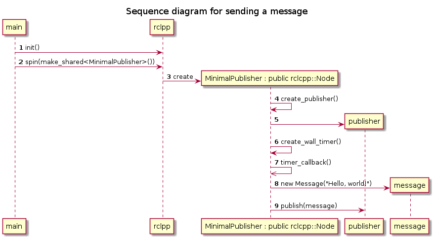

## ROS1 and ROS2 changes
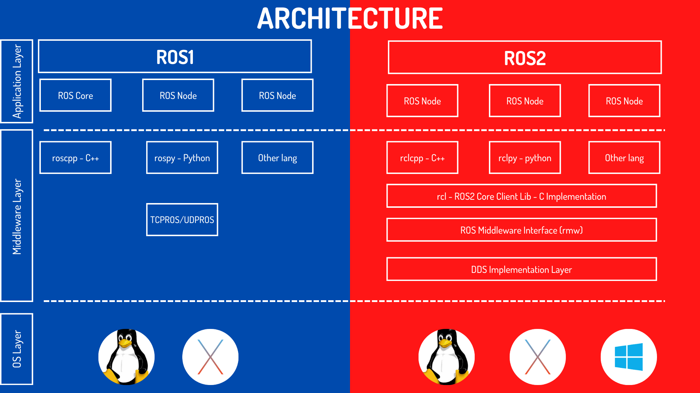
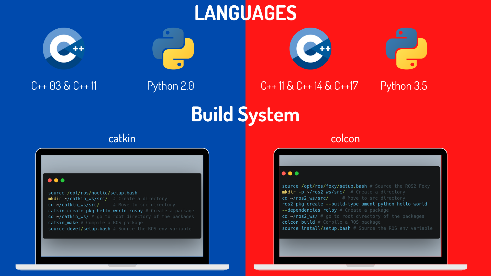
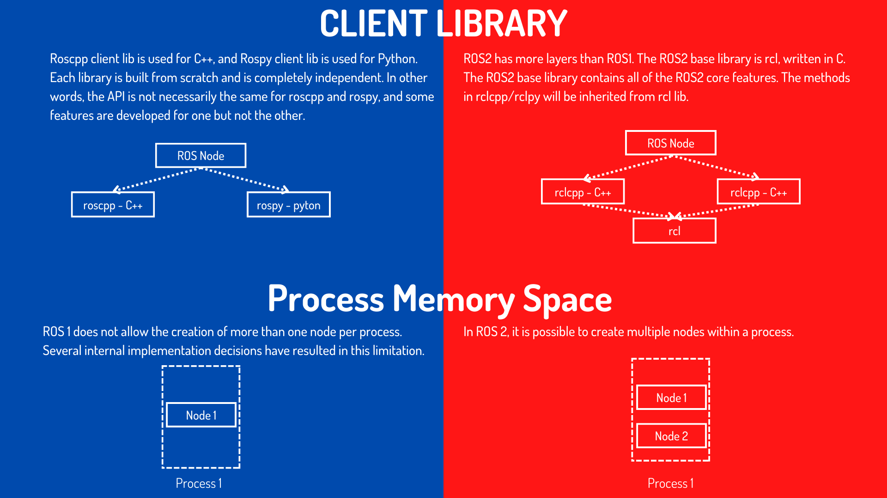
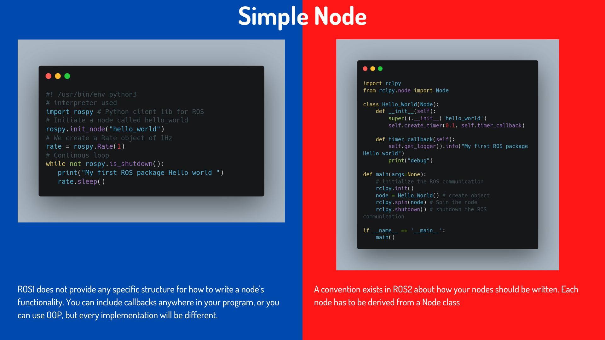
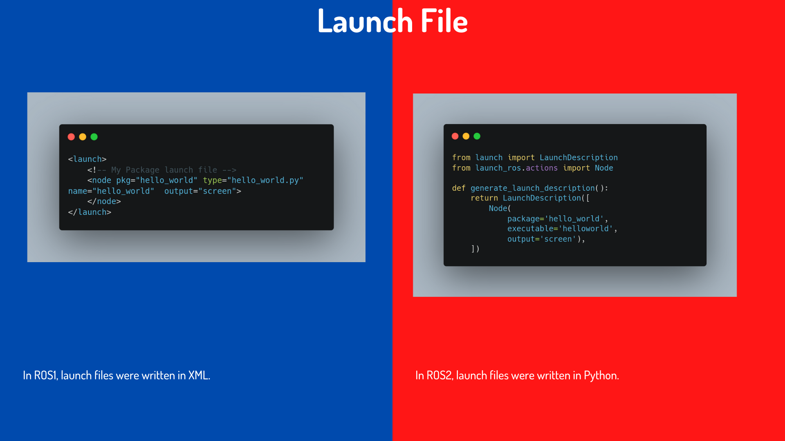
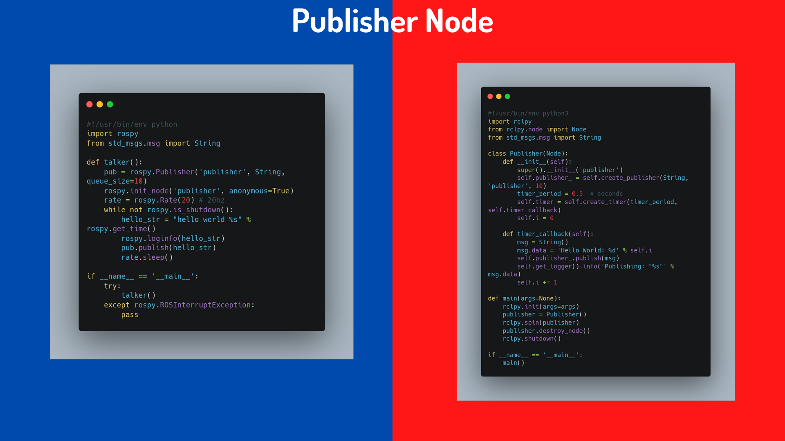
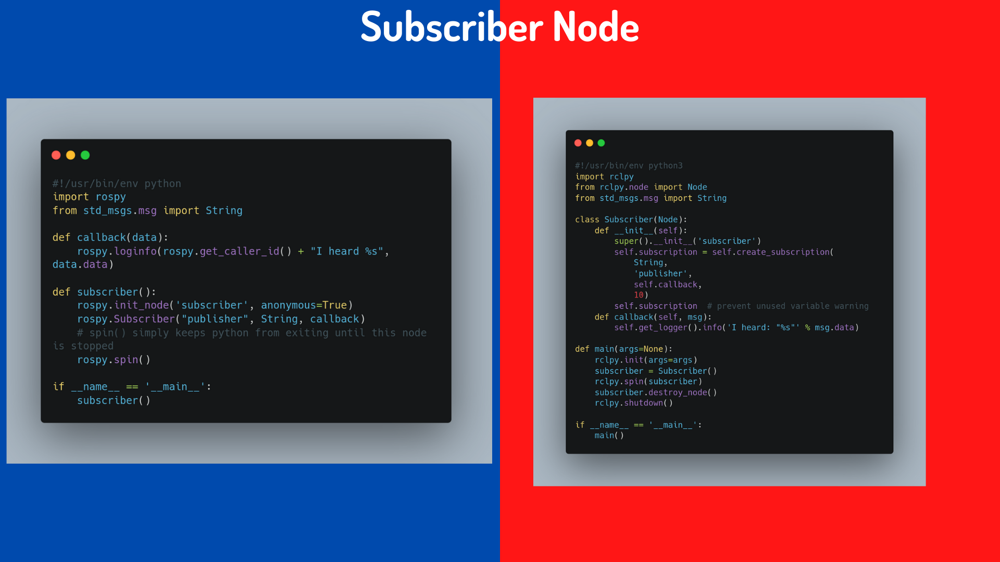