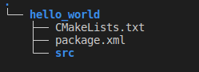
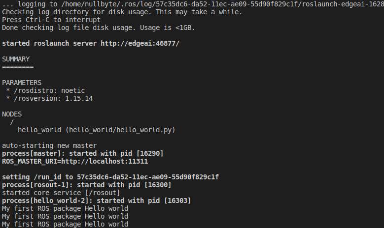
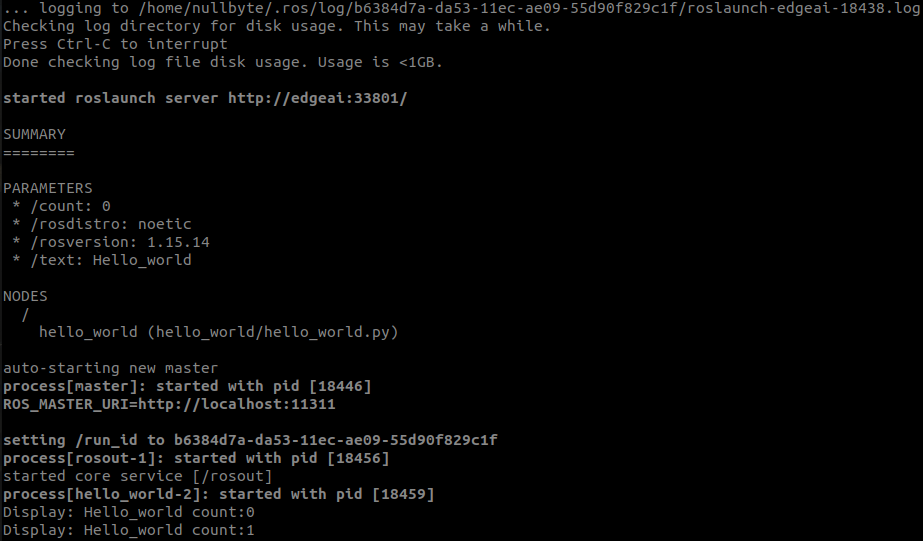
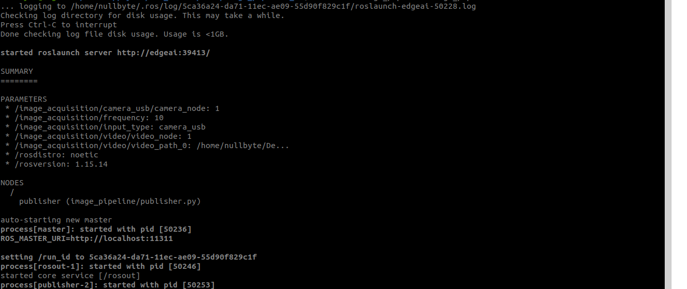
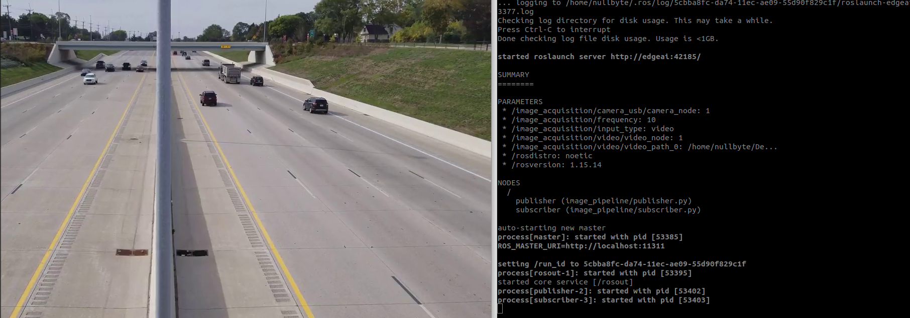

# ROS 1 Basics
## Create a First package
1. create a package
2. create a node [Python]
3. Create a launch file
4. Compile
5. Run 

### Create a Package 
```bash
mkdir ~/catkin_ws/src/  # Create a directory
cd ~/catkin_ws/src/     # Move to src directory
catkin_create_pkg hello_world rospy # Create a package
# rospy is python clinet lib for ROS
```



### Create a node
```bash
cd hello_world/ && touch src/hello_world.py # Create a empty file
chmod a+x src/hello_world.py # Execution permission
```

```bash
hello_world.py
```

```python
#! /usr/bin/env python3 
# interpreter used
import rospy # Python client lib for ROS

rospy.init_node("hello_world")     # Initiate a node called hello_world
rate = rospy.Rate(1)               # We create a Rate object of 1Hz
while not rospy.is_shutdown():     # Continous loop
   print("My first ROS package Hello world ")
   rate.sleep()                    # We sleep the needed time to maintain the above Rate
```

### Create a Launch file
```bash
mkdir launch && touch launch/hello_world.launch # Create a empty lauch file
```
```bash
hello_world.launch
```

```xml
<launch>
    <!-- My Package launch file -->
    <node pkg="hello_world" type="hello_world.py" name="hello_world"  output="screen">
    </node>
</launch>
```

### Compile
```bash
cd ~/catkin_ws/ # go to root directory of the packages
catkin_make # Compile a ROS package
source devel/setup.bash # Source the ROS env variable
```

### RUN
```bash
roslaunch hello_world hello_world.launch
```

#### output


## Basic ROS Concepts:
### Param Server:
A parameter server is a shared, multi-variate dictionary that is accessible via network APIs. Nodes use this server to store and retrieve parameters at runtime. 

### Create a Param file
```bash
cd ~/catkin_ws/src/hello_world/ && mkdir config/ && touch config/param.yaml
```
```bash
config/param.yaml
```

```xml
text: "Hello_world"
count: 0 
```

### Load and Retrieving ROS param 

```bash
hello_world.launch #Updated version
```

```xml
<launch>
    <!-- Load config file -->
    <rosparam file="$(find hello_world)/config/param.yaml" />
    <!-- hello world launch file -->
    <node pkg="hello_world" type="hello_world.py" name="hello_world"  output="screen">
    </node>
</launch>

```bash
hello_world.py # Updated version 
```

```python
#! /usr/bin/env python3 
# interpreter used
import rospy # Python client lib for ROS

rospy.init_node("hello_world")     # Initiate a node called hello_world
rate = rospy.Rate(1)               # We create a Rate object of 1Hz
display = rospy.get_param("/text")
count = rospy.get_param("/count")
while not rospy.is_shutdown():     # Continous loop
   global count
   print("Display: {} count:{} \n".format(display, count))
   count += 1
   rate.sleep()                    # We sleep the needed time to maintain the above Rate
```

### Compile
```bash
cd ~/catkin_ws/ # go to root directory of the packages
catkin_make # Compile a ROS package
source devel/setup.bash # Source the ROS env variable
```


### RUN
```bash
roslaunch hello_world hello_world.launch
```

#### output


## Debugging Tools

```bash
rosnode list #list all the runnig nodes
rosnode info <node_name> #Info about particular node
```

## ROS Topics

Topics are named buses over which nodes exchange messages. Topics are intended for unidirectional, streaming communication.


### ROS Topic Transports

ROS currently supports TCP/IP-based and UDP-based message transport. The TCP/IP-based transport is known as TCPROS and streams message data over persistent TCP/IP connections. TCPROS is the default transport used in ROS and is the only transport that client libraries are required to support. The UDP-based transport, which is known as UDPROS and is currently only supported in roscpp, separates messages into UDP packets. UDPROS is a low-latency, lossy transport, so is best suited for tasks like teleoperation.

### ROS Topic tools

```bash
rostopic list # List all ROS topics
rostopic echo /topic_name # Display the messages published to /topic_name
```

## ROS Topics with ROS Perception Packages
## Topic Publisher
### Create a Package
```bash
mkdir ~/catkin_ws/src/  # Create a directory
cd ~/catkin_ws/src/     # Move to src directory
catkin_create_pkg image_pipeline rospy cv_bridge image_transport sensor_msgs # Create a package
```

### Create a node
```bash
cd image_pipeline/ && touch src/publisher.py # Create a empty file
chmod a+x src/publisher.py # Execution permission
```

```bash
publisher.py
```

```python
#!/usr/bin/env python3
import sys
import rospy
from sensor_msgs.msg import Image
from cv_bridge import CvBridge
import cv2

class Publisher:
    def __init__(self):
        self.image_pub = rospy.Publisher("publisher", Image, queue_size=100)
        self.bridge = CvBridge()
        self.image_publisher()

    def image_publisher(self,):
        
        frequency = rospy.get_param("/image_acquisition/frequency")
        rate = rospy.Rate(frequency)

        input_type = rospy.get_param("/image_acquisition/input_type")
        
        video_capture = None
        if input_type == "camera_usb":
            video_capture = cv2.VideoCapture(0)
        else:
            video_path = rospy.get_param("/image_acquisition/video/video_path_0")
            video_capture = cv2.VideoCapture(video_path)
        
        while True:
            ret, frame = video_capture.read()
            if frame is not None:
                msg = self.bridge.cv2_to_imgmsg(frame, "bgr8")
                self.image_pub.publish(msg)
                rate.sleep()

def main(args):
    rospy.init_node('publisher')
    Publisher()
if __name__ == '__main__':
    main(sys.argv)

```

### Create a config file
```bash
cd ~/catkin_ws/src/image_pipeline/ && mkdir config/ && touch config/param.yaml
```

```
config/param.yaml
```

```xml
image_acquisition:
  input_type: "camera_usb" #camera_usb, video
  
  camera_usb: 
      camera_node: 1
  
  video:
      video_node: 1
      video_path_0: "/home/nullbyte/Desktop/myGit/ROS_Basics/ROS1/test_data/video/test_1.mp4"
  
  frequency: 10
```

### Create a Launch file
```bash
mkdir launch && touch launch/image_pipeline.launch # Create a empty lauch file
```
```bash
image_pipeline.launch
```

```xml
<launch>
    <rosparam file="$(find image_pipeline)/config/param.yaml" />
    <!-- image_pipeline launch file -->
    <node pkg="image_pipeline" type="publisher.py" name="publisher"  output="screen">
    </node>
</launch>
```

### Compile
```bash
cd ~/catkin_ws/ # go to root directory of the packages
catkin_make # Compile a ROS package
source devel/setup.bash # Source the ROS env variable
```

### RUN
```bash
roslaunch image_pipeline image_pipeline.launch
```

#### output



## Topic Subscriber
### Create a node
```bash
cd image_pipeline/ && touch src/subscriber.py # Create a empty file
chmod a+x src/subscriber.py # Execution permission
```

```bash
subscriber.py
```

```python
#!/usr/bin/env python3
import sys
import rospy
from sensor_msgs.msg import Image
from cv_bridge import CvBridge, CvBridgeError
import cv2

class Subscriber:
    def __init__(self):
        self.image_sub = rospy.Subscriber("publisher", Image, self.callback)
        self.bridge = CvBridge()
        
    def callback(self,data):
        try:
            cv_image = self.bridge.imgmsg_to_cv2(data, "bgr8")
            cv2.imshow("Display", cv_image)
            cv2.waitKey(1)

        except CvBridgeError as e:
            print(e)

def main(args):
    rospy.init_node('subscriber')
    Subscriber()
    try:
        rospy.spin()
    except KeyboardInterrupt:
        print("Shutting down")

if __name__ == '__main__':
    main(sys.argv)
```

### Update the Launch file
```bash
image_pipeline.launch
```

```xml
<launch>
    <rosparam file="$(find image_pipeline)/config/param.yaml" />
    <!-- image_pipeline launch file -->
    <node pkg="image_pipeline" type="publisher.py" name="publisher"  output="screen">
    </node>
    <node pkg="image_pipeline" type="subscriber.py" name="subscriber"  output="screen">
    </node>
</launch>
```

### Compile
```bash
cd ~/catkin_ws/ # go to root directory of the packages
catkin_make # Compile a ROS package
source devel/setup.bash # Source the ROS env variable
```

### RUN
```bash
roslaunch image_pipeline image_pipeline.launch
```

#### output
